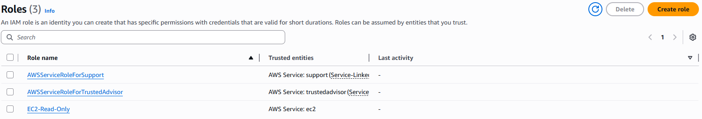
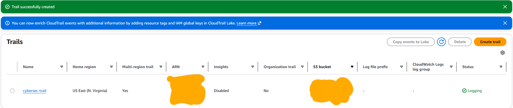
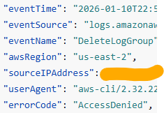
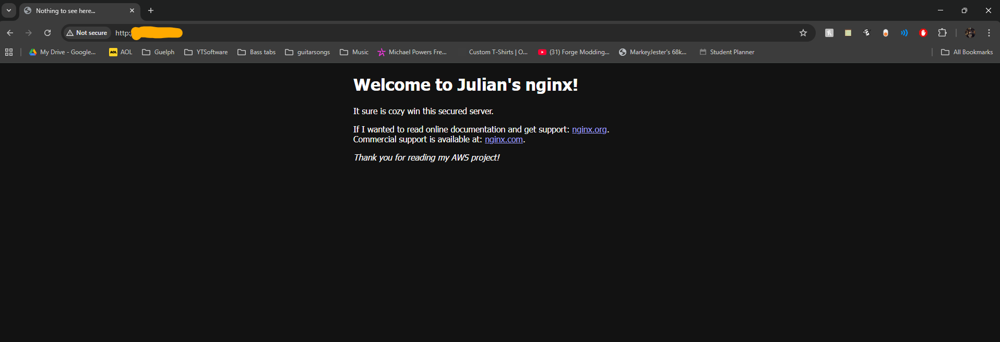

# cloud-security-ec2

## IAM (Identity and Access Management) Security Design

 - Created an IAM role with CloudWatchLogsReadOnlyAccess
 - Attached the role directly to the EC2 instance
 - Verified that read actions were allowed and write actions were denied

## Network Security (Security Groups)

 - SSH (port 22) restricted to my public IP only
 - HTTP (port 80) opened only after Nginx installation
 - Prevents unauthorized access and automated bot scanning

## CloudTrail Auditing & Log Integrity

 - Enabled CloudTrail log file validation to create a digital signature to prove logs are not tampered with. 
 - Captured management operations (both read and write)
 - Used event history to audit IAM actions

## How I Tested My EC2 Server

### IAM Role Testing
aws logs describe-log-groups 
 - Allowed and functional
aws logs create-log-group --log-group-name TestGroup
 - Got a "AccessDeniedException" permissions error

This shows that I have read but not write permissions.

### Security Group Testing
 - Changed SSH source IP to a random address and tried to connect.
 - This test gave an 'Connection timed out' error and did not allow me to sign in.

The failed connection verifies other IPs may not attempt maliciously connecting with a guessed private key

### CloudTrail Verification

Tested my CloudTrail by finding the IAM role tests previously mentioned.

It's interesting to know that not only can I see from the event history that it failed with the error code, but I can also see things like the time and source of the request.

Verifying a successful log file validation (digest file retrieval and CLI-based validation) was considered but skipped 
due to its complexity and limited additional learning value.

## Web Server Deployment

 - Installed Nginx on Amazon Linux 2023
 - Enabled HTTP traffic in the security group
 - Edited default index.html

## What I learned

 - How AWS enforces least privilege
How verifying failed actions is used as valuable security data
How CloudTrail supports event tracking and auditing
How virtual Linux file system paths/permissions work
How to safely expose an AWS service to the public

## Process Challenges
 - Creating security protocols but not understanding how an attacked would exploit my server if I didn't have them
 - Thought my instance wasn't running because my AWS region selector wasn't in the region the instance was running in. When I tried to connect there were different security groups in that region which prevented me from connecting, which all led me to believe there was no instance. I fixed this by changing the region to the correct region and changing the security group to allow myself to properly attempt log ins
 - Concerned when connecting to my aws server because PowerShell warns about the authenticity of the host and about permanently adding the public ip to a list of known hosts. (this is actually expected)
 - My IAM role not working when trying to use allowed commands "Unable to locate credentials. You can configure credentials by running "aws login"." The issue was the I created the IAM role but did not attach it to my instance.
 - Confusion over where nginx files were located at first. Realized I could actually enter the parent folders outside of /home/ec2-user and see all the other directories that eventually lead to the html files.
