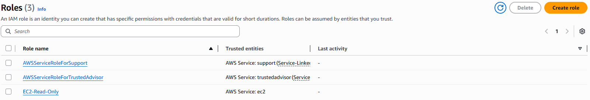
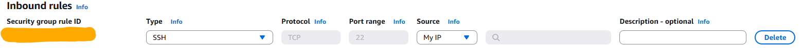
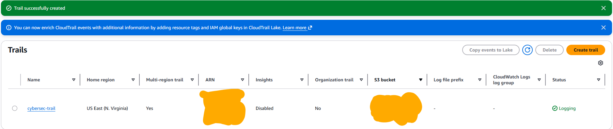
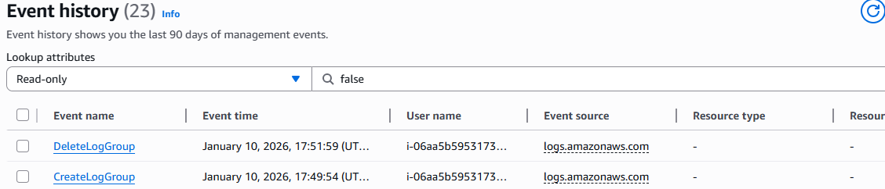
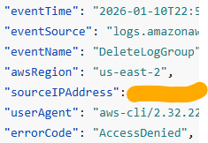
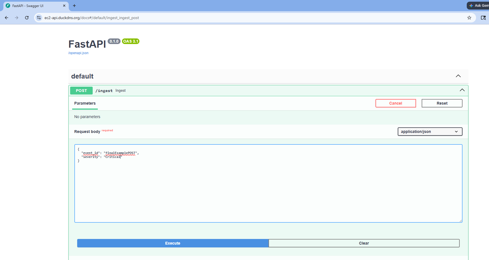
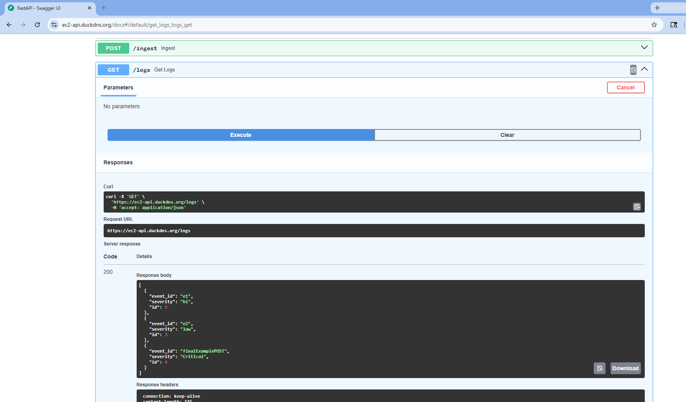

# cloud-security-ec2
This project was completed in 2 parts.<br>
First I secured an AWS EC2 with least-privilege IAM, CloudTrail, and Nginx web server.<br>
Next I created a working local RESTful API to communicate ETL operations to a PostgreSQL database, then containerized (Docker) it and deployed it on a secure EC2 server.

## Architectural Design

> ec2-api.duckdns.org/docs -> Nginx Reverse Proxy -> FastAPI -> PostgreSQL

 - The website holds a FastAPI front-end with working POST and GET actions.
 - The Nginx handles HTTPS encryption and rate limiting.
 - FastAPI uses Pydantic to enforce the data schema and uses SQLAlchemy to communicate with PostgreSQL.

## Container Orchestration

 Network Isolation: Only the Nginx container has ports 80 and 443 mapped to the EC2 instance.<br>
 Volume Persistence: Database records are stored in a Docker volume, ensuring data survives container restarts or updates. (compose down with -v flag may be used to wipe the database clean)<br>
 Zero-Footprint Build: A .dockerignore file is used to avoid leaking SSL keys or other sensitive files.<br>

 ## How to Run

This repo is configured to run on an AWS EC2 instance.

 1. Prerequisites:<br>
 - Docker, Docker-Compose
 - DuckDNS for domain routing
 - Let's Encrypt for HTTPS (must generate SSL certificates and place them in api/certbot/conf).
 2. Deployment<br>
 ```bash
 git pull origin main
 docker-compose up -d --build
```
 3. Persistence<br>
 Stop the server with persistence
 ```bash
 docker-compose down
 ```
 Stop the server AND *WIPE* THE DATABASE
 ```bash
 docker-compose down -v
 ```

## IAM (Identity and Access Management) Security Design



 - Created an IAM role with CloudWatchLogsReadOnlyAccess
 - Attached the role directly to the EC2 instance
 - Verified that read actions were allowed and write actions were denied


### Network Security (Security Groups)




 - SSH (port 22) restricted to my public IP only
 - HTTP/HTTPS (port 80 and 443) opened only after Nginx configuration
 - Restricting SSH access defends against noise from malicious or automated connection attempts, potential SSH vulnerabilities, and leaked keys


### CloudTrail Auditing & Log Integrity



 - Enabled CloudTrail log file validation to create a digital signature to prove logs are not tampered with. 
 - Captured management operations (both read and write)
 - Used event history to audit IAM actions


### How I Tested My EC2 Server

### IAM Role Testing
aws logs describe-log-groups 
 - Allowed and functional
aws logs create-log-group --log-group-name TestGroup
 - Got a "AccessDeniedException" permissions error

This shows that I have read but not write permissions.

#### Security Group Testing
 - Changed SSH source IP to a random address and tried to connect.
 - This test gave an 'Connection timed out' error and did not allow me to sign in.

The failed connection verifies non-whitelisted IPs may not attempt unauthorized SSH access.

#### CloudTrail Verification

Tested my CloudTrail by finding the IAM role tests previously mentioned.




It's interesting to know that not only can I see from the event history that it failed with the error code, but I can also see things like the time and source of the request.




Verifying a successful log file validation (digest file retrieval and CLI-based validation) was considered but skipped 
due to its complexity and limited additional learning value.


### Web Server Deployment

This is an example of a POST operation on the FastAPI site hosted at the DuckDNS URL.



This is an example of a GET operation which displays the contents of the PostgreSQL database.



## What I learned

 - How AWS enforces least privilege
 - How verifying failed actions is used as valuable security data
 - How CloudTrail supports event tracking and auditing
 - How virtual Linux file system paths/permissions work
 - Reverse proxy setup using Nginx to handle SSL termination and shield the FastAPI application from public exposure and spam requests
 - Automating TLS using Certbot and Let's Encrypt to maintain a HTTPS port
 - Containerized portability achieved through Docker allowed my local development of the API to be transferred to the cloud for EC2 specific implementation

## Process Challenges
 - Concerned when connecting to my AWS server because PowerShell warns about the authenticity of the host and about permanently adding the public IP to a list of known hosts. (this is actually expected)
 - My IAM role not working when trying to use allowed commands "Unable to locate credentials. You can configure credentials by running "aws login"." The issue was the I created the IAM role but did not attach it to my instance.
 - When transitioning from a local version to the EC2 server, I installed Docker on the root-level, creating a system wide cli plugins directory which caused issues with the user-level Git repo. I solved this by adding the ec2-user to the docker group, which allowed non-root execution of the Docker installation.
 - Battled permissions issues using sudo: Essentially sudo works on the root level and will create files the user cannot read, eventually causing trivial actions to require sudo permissions.
 - Permissions Ghosts: Certbot-generated certificates were owned by root, which prevented me (the ec2-user) from including them in the Docker build. This is when I realized the Docker Daemon actually shouldn't have access to the SSL Certificates anyway and created a .dockerignore, then corrected ownership of the files.
 - Nginx Scope: Learned that my limit_req_zone must be defined outside of the server{} to allow it to be seen in the global context and have the necessary shared memory allocated at startup.

[View Screenshot](https://github.com/user-attachments/assets/a3f37c8a-f9f0-4bc5-a980-5469fda9cce7)
